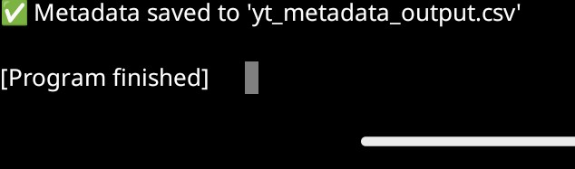

# 📺 YouTube Metadata Scraper

Hi! This is a Python script I built to extract metadata from YouTube videos using a list of URLs. It uses `yt_dlp`, which supports Shorts, long videos, and restricted content. The output is saved in a clean CSV file for analysis or reporting.

## 🔧 What It Does
- Reads video URLs from `video_urls.csv`
- Extracts:
  - Title
  - Channel name
  - Views
  - Duration (in seconds)
  - Upload date
  - Description (first 200 characters)
- Saves the data into `yt_metadata_output.csv` using pandas

## 🛠️ Tools Used
- `yt_dlp` for metadata extraction
- `pandas` for CSV input/output

## 🚀 How to Run It
1. Make sure you have Python installed
2. Install the required libraries:
    pip install yt-dlp pandas
3. Run the script:
    python yt_scraper.py  
4. Check your folder for `yt_metadata_output.csv` — it’ll have all the scraped metadata

## 📦 Sample Output

| Title         | Channel     | Views     | Duration (sec) | Upload Date | Description |
|---------------|-------------|-----------|----------------|-------------|-------------|
| How to Code   | CodeWithMe  | 1234567    | 754            | 2023-10-01  | Learn Python fast... |

## 🖼️ Script Output

Here’s a screenshot of the script running successfully:

